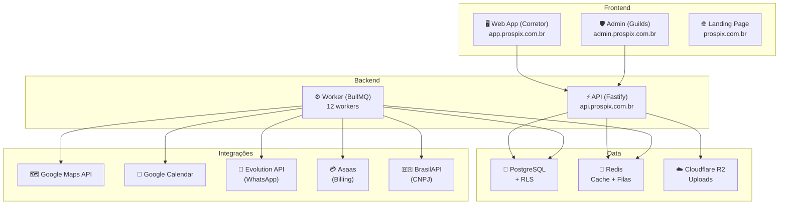
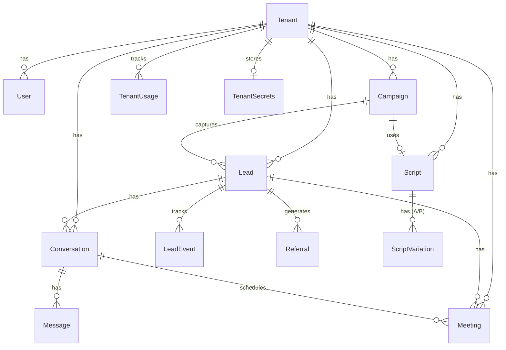
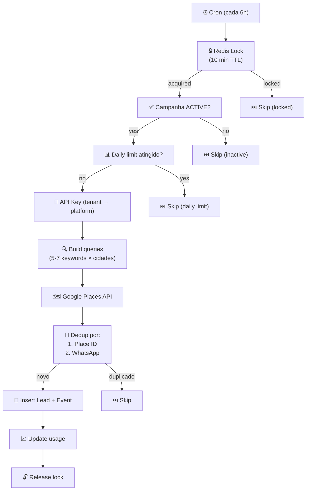
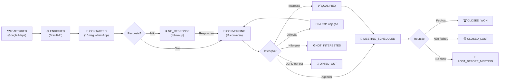
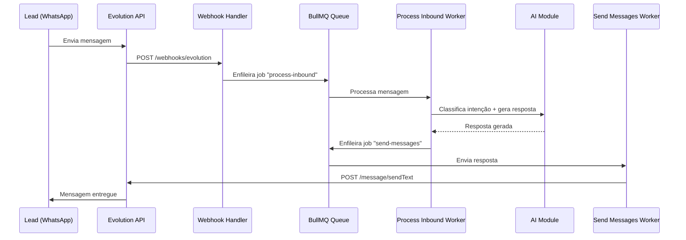
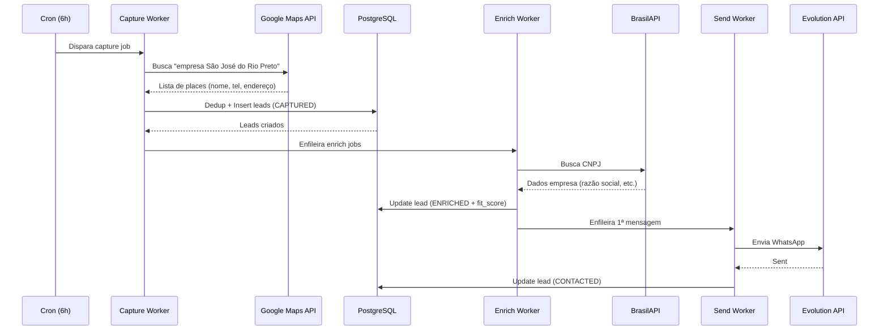

# Prospix — Documentação Técnica do Sistema

> **Plataforma de Prospecção Inteligente Multi-Tenant**
> Desenvolvida por **Guilds** · Projeto liderado por Gustavo Macedo
> Última atualização: Junho 2026 (Core Engine V2 Produção)

---

## 1. Visão Geral do Produto e Status de Produção

### 1.1 O que é o Prospix

O Prospix é uma **plataforma SaaS multi-tenant de prospecção automatizada** voltada para **corretores de seguros**. A plataforma captura leads de fontes públicas, enriquece dados, aborda automaticamente via WhatsApp usando IA conversacional, agenda reuniões e acompanha o funil de vendas completo.

### 1.2 Status de Produção (100% Pronto)
Os seguintes módulos compõem a versão V2 do Core Engine e já estão 100% integrados em produção:
- **Editor Visual de Fluxo (React Flow):** Totalmente operacional. O diagrama visual desenhado na UI é compilado como State Machine e injetado no System Prompt da IA para governar o fluxo.
- **Configuração de IA por Tenant:** Modelo (GPT-4o-mini), temperatura e instruções base configuráveis via UI e integradas na Engine.
- **Loop de Indicações (Referrals):** Coleta, registro e transformação automática de indicações em novos leads.
- **Real-Time Escalation:** Notificação de requisição de suporte humano no WhatsApp do usuário e auto-pausa da automação IA.
- **Envio de Mídias (Function Calling):** A IA decide autonomamente quando enviar um PDF (presentation) através da tool `send_pdf`, via Evolution API.
- **Auto Mode Discovery:** Worker que descobre campanhas ativas e gerencia as buscas automaticamente.

### 1.3 Limitações Conhecidas (Não 100% Pronto)
- **Bloqueio de IP em Scrapers (WAF):** Alguns scrapers (CRO/OAB) podem sofrer 403 Forbidden por bot protection da Cloudflare, exigindo uso de proxies residenciais para operar em alta escala.
- **Dashboard Financeiro (Stripe/Asaas):** Frontend exibe dados de mock e a sincronização completa de boletos Asaas em tela requer refinos.
- **Gráficos Avançados de Performance:** Funil histórico com drop-off de conversão avançada requer maior volume de dados para exibição polida.

---

## 2. Proposta de Valor

| Para | Benefício |
|---|---|
| **Corretor** | Prospecta leads automaticamente 24/7 sem precisar ligar ou enviar mensagens manualmente |
| **Guilds (operadora)** | Plataforma multi-tenant que escala horizontalmente — cada novo corretor é só um tenant novo |

### 1.3 Modelo de Negócio

- **Setup:** R$ 7.900 (one-time, por tenant)
- **Mensalidade:** R$ 490/mês (MRR)
- **Escala:** 10 tenants = R$ 4.900/mês de MRR com infra praticamente fixa

### 1.4 Primeiro Cliente (Tenant #1)

**Giovane Rodrigues Carrara** — Corretor parceiro MetLife
- Região: São José do Rio Preto, SP + Olímpia, SP
- Produtos: MetLife Vida Individual, MetLife Vida PME, MetLife Dental
- 3 campanhas ativas: Empresários Rio Preto, Empresários Olímpia, Advogados Rio Preto

---

## 2. Arquitetura do Sistema

### 2.1 Arquitetura Multi-Tenant



### 2.2 Modelo de Isolamento

**Shared database, shared schema, row-level isolation:**
- Coluna `tenant_id UUID NOT NULL` em **todas** as tabelas de domínio
- PostgreSQL Row Level Security (RLS) ativo
- Middleware obrigatório na API que injeta `tenant_id` no contexto de cada request
- Frontend nunca aceita resposta com `tenant_id` diferente do autenticado

### 2.3 Hierarquia de Acesso

```
Guilds (super-admin — GUILDS_ADMIN)
  ├── Tenant #1 — Giovane Carrara (OWNER)
  │     └── [futuro] Assistentes (ASSISTANT)
  ├── Tenant #2 — [futuro]
  └── ...
```

---

## 3. Stack Tecnológico

### 3.1 Monorepo (pnpm workspaces + Turborepo)

```
prospix/
├── apps/
│   ├── api/          → Backend API + Workers (Fastify + BullMQ)
│   ├── web/          → Painel do Corretor (React + Vite)
│   ├── admin/        → Painel Admin Guilds (React + Vite)
│   └── landing/      → Site institucional (Next.js)
├── packages/
│   ├── shared-types/  → TypeScript types compartilhados
│   ├── ui/            → Componentes UI compartilhados (Toast, etc.)
│   └── mocks/         → Mocks para testes
├── docs/              → Documentação (PRD, design-system, etc.)
├── business/          → Docs comerciais (proposta, orçamento)
├── e2e/               → Testes end-to-end (Playwright)
└── Dockerfile         → Build da imagem API
```

### 3.2 Tecnologias

| Camada | Tecnologia |
|---|---|
| **Runtime** | Node.js 20 (Alpine) |
| **Linguagem** | TypeScript (strict mode) |
| **API Framework** | Fastify |
| **ORM** | Prisma 5.22 |
| **Banco de Dados** | PostgreSQL (com RLS, pgcrypto, pg_trgm) |
| **Cache/Filas** | Redis 7 + BullMQ |
| **Frontend** | React 18 + Vite |
| **UI Styling** | Tailwind CSS (admin/landing) + Vanilla CSS (web) |
| **Roteamento** | React Router v6 |
| **State Management** | Zustand |
| **Landing Page** | Next.js |
| **Build** | tsup (API), Vite (frontends) |
| **Monorepo** | pnpm workspaces + Turborepo |
| **Testes** | Vitest (unit) + Playwright (e2e) |

---

## 4. Banco de Dados (Prisma Schema)

### 4.1 Enums Principais

| Enum | Valores |
|---|---|
| `TenantStatus` | `ONBOARDING`, `ACTIVE`, `SUSPENDED`, `CHURNING`, `CHURNED` |
| `TenantPlan` | `STARTER`, `STANDARD`, `PREMIUM` |
| `UserRole` | `OWNER`, `ASSISTANT`, `GUILDS_ADMIN` |
| `CampaignStatus` | `DRAFT`, `ACTIVE`, `PAUSED`, `ARCHIVED` |
| `Profession` | `DOCTOR`, `LAWYER`, `DENTIST`, `ENTREPRENEUR`, `ENGINEER`, `ARCHITECT`, `ACCOUNTANT`, `OTHER` |
| `LeadSource` | `GOOGLE_MAPS`, `RECEITA_FEDERAL`, `CRM_SP`, `OAB_SP`, `CRO_SP`, `LINKEDIN`, `REFERRAL`, `LANDING_PAGE`, `MANUAL`, `IMPORTED` |
| `LeadStatus` | `CAPTURED` → `ENRICHED` → `CONTACTED` → `CONVERSING` → `QUALIFIED` → `MEETING_SCHEDULED` → `CLOSED_WON` / `CLOSED_LOST` / `NOT_INTERESTED` / `OPTED_OUT` |
| `ConversationStatus` | `ACTIVE`, `PAUSED`, `ESCALATED`, `CLOSED` |
| `MessageDirection` | `INBOUND`, `OUTBOUND` |
| `MessageSender` | `AI`, `USER`, `LEAD` |
| `MeetingStatus` | `SCHEDULED`, `CONFIRMED`, `HAPPENED`, `NO_SHOW`, `RESCHEDULED`, `CANCELLED` |
| `ScriptCategory` | `APPROACH`, `OBJECTION`, `EDUCATION`, `CLOSING`, `FOLLOW_UP`, `REFERRAL`, `REACTIVATION` |

### 4.2 Modelos Principais



#### Modelos detalhados:

| Modelo | Campos-chave | Propósito |
|---|---|---|
| **Tenant** | `slug`, `name`, `status`, `plan`, `mrrCents`, `segment` | Raiz multi-tenant (corretora) |
| **User** | `email`, `role`, `name`, `whatsapp` | Usuários do sistema |
| **Campaign** | `profession`, `cities[]`, `neighborhoods[]`, `dailyLimit`, `activeScriptId` | Campanhas de prospecção |
| **Lead** | `name`, `whatsapp`, `profession`, `fitScore`, `status`, `address`, `googleRating` | Leads capturados |
| **LeadEvent** | `eventType`, `payload` | Timeline de eventos do lead |
| **Conversation** | `leadId`, `scriptId`, `status`, `messageCount`, `aiTokensUsed` | Conversas WhatsApp |
| **Message** | `content`, `direction`, `sender`, `deliveryStatus`, `llmModel`, `llmCostCents` | Mensagens individuais |
| **PendingOutbound** | `content`, `scheduledFor`, `idempotencyKey` | Fila de mensagens off-hours |
| **Meeting** | `scheduledFor`, `status`, `outcome`, `policyValueCents`, `commissionCents` | Reuniões agendadas |
| **Script** | `category`, `flow` (JSON), `baseMessage`, `variables[]`, `responseRate` | Roteiros de abordagem |
| **ScriptVariation** | `variantLetter`, `message`, `weight` | Variações A/B do roteiro |
| **ScriptTemplate** | Global (sem tenant) — templates de roteiro | Templates master para clonagem |
| **TenantSecrets** | `googleRefreshToken`, `googleCalendarId`, `googleMapsApiKey` (encrypted) | Segredos por tenant |
| **TenantUsage** | `periodMonth`, `leadsCapturedCount`, `messagesSentCount`, `llmTotalCostCents` | Uso mensal por tenant |
| **Referral** | `name`, `whatsapp`, `convertedLeadId` | Indicações coletadas |
| **FeatureFlag** | `key`, `enabled`, `rules` (JSON) | Feature flags por tenant |
| **LgpdRequest** | `type`, `status`, `requestedBy` | Requisições LGPD |
| **AdminAuditLog** | `action`, `actor`, `payload` | Log de auditoria admin |
| **DlqEntry** | `workerName`, `failedReason`, `sourceJobData` | Dead Letter Queue (falhas) |
| **AdminAlert** | `type`, `severity`, `title`, `resolvedAt` | Alertas do sistema |

---

## 5. API (Fastify)

### 5.1 Estrutura de Rotas

#### 5.1.1 Auth (`/v1/auth/`)

| Método | Rota | Descrição |
|---|---|---|
| `POST` | `/login` | Login com email + senha |
| `POST` | `/register` | Registro via código de convite |
| `POST` | `/refresh` | Refresh do JWT |
| `POST` | `/magic-link` | Login por link mágico |
| `POST` | `/google/callback` | OAuth callback (Google Calendar) |

**Autenticação:** JWT RS256 (par de chaves RSA)
- Access Token: 7 dias
- Refresh Token: 30 dias
- Magic Link: 600 segundos TTL

#### 5.1.2 Tenant (`/v1/tenant/`) — Requer autenticação + tenant context

| Módulo | Principais Endpoints |
|---|---|
| **Campanhas** | CRUD + `POST /:id/resume` (ativa + auto-agenda cron), `POST /:id/pause` (pausa + remove cron) |
| **Leads** | Listagem com filtros, busca, status updates, importação |
| **Conversas** | Listagem, detalhes com mensagens, envio manual |
| **Roteiros** | CRUD de scripts + variações A/B, preview, ativação |
| **Reuniões** | CRUD, registro de outcome, reagendamento |
| **Agenda** | Sync com Google Calendar, listagem semanal |
| **Pipeline** | Visualização Kanban do funil por status |
| **Dashboard** | KPIs: leads, conversas, reuniões, custos IA |
| **Indicações** | Listagem + criação de referrals |
| **Billing** | Asaas integration, invoices, status |
| **Settings** | Perfil, integrações (WhatsApp, Calendar, Maps) |
| **Notificações** | Listagem, mark-as-read |
| **LGPD** | Requisições de dados, anonimização, portabilidade |

#### 5.1.3 Admin (`/v1/admin/`) — Requer `GUILDS_ADMIN`

| Módulo | Descrição |
|---|---|
| **Tenants** | CRUD, onboarding wizard, detail view |
| **Users** | User management cross-tenant |
| **Campaigns** | Monitoramento cross-tenant + stats |
| **Leads** | Lead management cross-tenant |
| **Lead Sources** | Monitor de fontes de captura |
| **Pipeline** | Funil consolidado |
| **Performance** | Métricas avançadas |
| **Conversations** | Monitor de conversas |
| **Meetings** | Monitor de reuniões |
| **Referrals** | Monitor de indicações |
| **Scripts/Templates** | Templates globais de roteiros |
| **Feature Flags** | Gerenciamento de feature flags |
| **Impersonation** | Logar como qualquer tenant |
| **Observability** | Logs, métricas, health |
| **DLQ** | Dead Letter Queue (replay de jobs falhos) |
| **Alerts** | Alertas operacionais |
| **Discovery** | Busca exploratória cross-tenant |
| **Activity** | Feed de atividades do sistema |
| **Billing** | Billing consolidado |

#### 5.1.4 Webhooks (`/webhooks/`)

| Webhook | Fonte | Propósito |
|---|---|---|
| **Evolution** | Evolution API (WhatsApp) | Recebe mensagens inbound, status de delivery |
| **Asaas** | Asaas (billing) | Confirmação de pagamento, inadimplência |

#### 5.1.5 SSE (`/v1/tenant/sse`)

Server-Sent Events para real-time no frontend (notificações, status de conversas).

### 5.2 Middlewares

| Middleware | Função |
|---|---|
| `auth.ts` | Valida JWT, extrai `userId` e `role` |
| `tenant-context.ts` | Injeta `tenantId` no request, seta `app.tenant_id` no PostgreSQL para RLS |
| `idempotency.ts` | Previne requests duplicadas via header `Idempotency-Key` |

### 5.3 Módulo de IA

| Arquivo | Função |
|---|---|
| `router.ts` | Decide se a IA deve responder ou escalar para humano |
| `classifier.ts` | Classifica intenção do lead (interesse, objeção, agendar, não interessado) |
| `script-engine.ts` | Motor que executa o fluxo do roteiro (nodes/edges) |
| `prompt-builder.ts` | Constrói prompts dinâmicos com contexto do lead + script |
| `guardrails.ts` | Aplica guardrails: não prometer, não inventar dados, LGPD |
| `quota.ts` | Controla limites de uso de tokens por tenant |

---

## 6. Workers (Background Jobs)

### 6.1 Infraestrutura

- **Engine:** BullMQ sobre Redis
- **Padrão:** 1 worker global por fila (não 1 por tenant)
- **Retry:** 3 tentativas com backoff exponencial (1s → 2s → 4s)
- **DLQ:** Jobs exauridos vão para tabela `DlqEntry` no PostgreSQL
- **Concurrency:** Configurável por worker

### 6.2 Workers Ativos (12)

| # | Worker | Cron | Descrição |
|---|---|---|---|
| 1 | `capture-google-maps` | `0 */6 * * *` (por campanha) | Busca leads no Google Maps Places API com múltiplas keywords por profissão |
| 2 | `enrich-leads` | sob demanda | Enriquece leads com dados da Receita Federal (BrasilAPI) |
| 3 | `send-messages` | sob demanda | Envia mensagens via Evolution API (WhatsApp). Concurrency=1 (sequencial por tenant) |
| 4 | `process-inbound` | sob demanda | Processa mensagens recebidas: classifica intenção, gera resposta IA, enfileira envio |
| 5 | `schedule-meeting` | sob demanda | Cria evento no Google Calendar quando IA detecta agendamento |
| 6 | `send-notification` | sob demanda | Envia notificações push/email/WhatsApp para o corretor |
| 7 | `health-check` | cada 5 min | Verifica saúde de cada tenant (Evolution API, etc.) |
| 8 | `daily-digest` | `0 8 * * *` | Envia resumo diário ao corretor (leads, reuniões, métricas) |
| 9 | `usage-aggregation` | `0 * * * *` | Agrega métricas de uso por tenant (a cada hora) |
| 10 | `billing-suspension` | sob demanda | Suspende tenants com billing overdue |
| 11 | `process-lgpd-request` | sob demanda | Processa requisições LGPD (anonimização, exportação) |
| 12 | `alert-scan` | `15 8 * * *` | Scanner diário de alertas operacionais |

### 6.3 Fluxo do Capture Worker (Google Maps)



**Keywords por profissão (exemplo ENTREPRENEUR):**
- `empresa`, `escritório`, `loja`, `comércio`, `empreendedor`, `empresário`, `estabelecimento comercial`

**Keywords por profissão (exemplo LAWYER):**
- `advogado`, `escritório de advocacia`, `advocacia`, `advogados associados`, `consultoria jurídica`

### 6.4 Auto-Scheduling de Campanhas

O sistema **automaticamente** gerencia os crons de captura:

| Evento | Ação |
|---|---|
| Campanha `resume` (DRAFT/PAUSED → ACTIVE) | Cria cron `0 */6 * * *` |
| Campanha `pause` (ACTIVE → PAUSED) | Remove cron |
| Campanha `archive` (→ ARCHIVED) | Remove cron |
| Worker boot | Reschedule de todas as campanhas ACTIVE com cidades |

---

## 7. Integrações

### 7.1 Google Maps Places API

| Item | Detalhe |
|---|---|
| **Propósito** | Captura de leads (nome, telefone, endereço, rating) |
| **Rate Limit** | Token bucket: 100 QPS |
| **API Key** | Fallback: tenant own → platform shared |
| **Arquivo** | `apps/api/src/integrations/google-maps.ts` |

### 7.2 Google Calendar

| Item | Detalhe |
|---|---|
| **Propósito** | Sync de reuniões agendadas pela IA |
| **Auth** | OAuth2 (refresh token por tenant) |
| **Arquivo** | `apps/api/src/integrations/google-calendar.ts` |

### 7.3 Evolution API (WhatsApp)

| Item | Detalhe |
|---|---|
| **Propósito** | Envio/recebimento de mensagens WhatsApp |
| **Instância** | `guilds_master` na URL `evo.prospix.com.br` |
| **Webhook** | Recebe `messages.upsert`, `message.status.update`, etc. |
| **Arquivo** | `apps/api/src/integrations/evolution.ts` |

### 7.4 Asaas (Billing)

| Item | Detalhe |
|---|---|
| **Propósito** | Cobrança automatizada dos tenants |
| **Webhook** | Confirmação de pagamento, inadimplência |
| **Arquivo** | `apps/api/src/integrations/asaas.ts` |

### 7.5 BrasilAPI

| Item | Detalhe |
|---|---|
| **Propósito** | Enriquecimento de leads via CNPJ (Receita Federal) |
| **Arquivo** | `apps/api/src/integrations/brasilapi.ts` |

---

## 8. Frontend — Painel do Corretor (Web App)

### 8.1 Rotas e Páginas

| Rota | Página | Descrição |
|---|---|---|
| `/` | `Home` | Dashboard com KPIs, gráficos de desempenho, métricas do dia |
| `/conversas` | `Conversations` | Chat com leads — visualiza/envia mensagens, escala para humano |
| `/funil` | `Pipeline` | Kanban do funil de vendas por status do lead |
| `/agenda` | `Schedule` | Calendário de reuniões + sync Google Calendar |
| `/leads` | `Leads` | Lista completa de leads com filtros, busca, status |
| `/roteiros` | `Scripts` | Editor de roteiros de abordagem com fluxo visual |
| `/campanhas` | `Campaigns` | Gestão de campanhas (criar, pausar, ativar, arquivar) |
| `/fontes` | `LeadSources` | Monitor de fontes de captura (campanhas ativas vs pausadas) |
| `/indicacoes` | `Referrals` | Painel de indicações coletadas em reuniões |
| `/performance` | `Performance` | Métricas avançadas de conversão, taxas, tempos |
| `/consumo-ia` | `AIConsumption` | Consumo de tokens IA e custos Google Maps |
| `/app-mobile` | `AppMobile` | QR Code / link para versão mobile (PWA) |
| `/configuracoes` | `Settings` | Perfil, integrações, branding, notificações |

### 8.2 Páginas de Autenticação

| Rota | Página |
|---|---|
| `/login` | Login (email + senha) |
| `/cadastro` | Signup via código de convite |
| `/cadastro/detalhes` | Detalhes do cadastro |
| `/auth/callback` | Callback OAuth |
| `/termos` | Termos de uso |
| `/privacidade` | Política de privacidade |

---

## 9. Frontend — Painel Admin Guilds

### 9.1 Páginas Admin (25 telas)

| Página | Descrição |
|---|---|
| `Dashboard` | Visão consolidada de todos os tenants |
| `Tenants` | Lista de tenants + status + MRR |
| `TenantDetail` | Detalhe completo de um tenant (credenciais, métricas, ações) |
| `NewTenant` | Wizard de onboarding de novo tenant |
| `UserManagement` | Gestão de usuários cross-tenant |
| `CampaignMonitor` | Campanhas de todos os tenants |
| `LeadManagement` | Leads cross-tenant |
| `LeadSourcesMonitor` | Fontes de captura consolidadas |
| `PipelineMonitor` | Funil consolidado |
| `Performance` | Métricas avançadas cross-tenant |
| `Conversations` | Monitor de conversas |
| `Meetings` | Monitor de reuniões |
| `ReferralMonitor` | Indicações consolidadas |
| `Templates` | Templates globais de roteiros |
| `FeatureFlags` | Feature flags por tenant |
| `Impersonation` | "Logar como" qualquer tenant |
| `Observability` | Logs, métricas, health checks |
| `Alerts` | Alertas operacionais do sistema |
| `Activity` | Feed de atividades |
| `Compliance` | LGPD, termos, consentimento |
| `Billing` | Billing consolidado |
| `Settings` | Config do admin |
| `Discovery` | Busca exploratória |
| `AuditLog` | Log de auditoria |
| `DLQ` | Dead Letter Queue — replay de jobs falhos |

---

## 10. Fluxo Operacional Completo

### 10.1 Ciclo de Vida do Lead



### 10.2 Fluxo de Mensagem Inbound



### 10.3 Fluxo de Prospecção Automática



---

## 11. Design System

### 11.1 Paleta de Cores

| Token | Valor | Uso |
|---|---|---|
| `--color-primary` | `#1B3A6B` | Botões, headers, elementos principais |
| `--color-accent` | `#E8981C` | CTAs, alertas, destaques |
| `--color-bg` | `#F8F9FB` | Background geral |
| `--color-card` | `#FFFFFF` | Cards e panels |
| `--color-text-primary` | `#0F172A` | Texto principal |
| `--color-text-secondary` | `#475569` | Texto auxiliar |
| `--color-text-muted` | `#94A3B8` | Texto desabilitado/sutil |
| `--color-border` | `#E5E7EB` | Bordas |
| `--color-success` | `#039855` | Status positivo |
| `--color-warning` | `#DC6803` | Alertas |
| `--color-danger` | `#D92D20` | Erros/delete |

### 11.2 Tipografia

- **Fonte principal:** Inter (Google Fonts)
- **Tamanhos:** 11px (caption) → 12px (body small) → 13px (body) → 14px (title) → 16px (heading) → 20px (h2) → 24px (h1)

### 11.3 Componentes UI

- Cards com bordas suaves (`rounded-xl`)
- Glassmorphism em headers
- Badges de status com cores semânticas + dot animado para "ativo"
- Tabelas com hover effect
- Modais com backdrop blur
- Toast notifications (sistema próprio no package `@prospix/ui`)

---

## 12. Infraestrutura de Produção

### 12.1 Servidor

| Item | Detalhe |
|---|---|
| **Provider** | Hostinger VPS |
| **IP** | `72.62.105.13` |
| **SO** | Linux |
| **Gerenciador** | Easypanel |
| **SSH** | `root@72.62.105.13:22` |

### 12.2 Containers Docker

| Container | Imagem | Porta | Função |
|---|---|---|---|
| `prospix-api` | `prospix-api:latest` | 3000 | API principal |
| `prospix-worker` | `prospix-api:latest` | — | Background workers (`node dist/workers/index.js`) |
| `prospix-redis` | `redis:7-alpine` | 6379 | Cache + filas BullMQ |
| `prospix-db-proxy` | `alpine/socat` | 5435 | Proxy para PostgreSQL externo |
| `easypanel-traefik` | `traefik:3.6.7` | 80/443 | Reverse proxy + SSL |

### 12.3 Serviços Externos (na mesma VPS)

| Container | Função |
|---|---|
| `evolution_evolution-api` | Evolution API v2.3.6 (WhatsApp) |
| `evolution_evolution-api-db` | PostgreSQL 17 (banco Evolution) |
| `evolution_evolution-api-redis` | Redis 7 (cache Evolution) |
| `n8n_n8n` | N8N 2.2.3 (automações) |
| `n8n_postgres` | PostgreSQL 17 (banco N8N) |
| `n8n_redis` | Redis 7 (cache N8N) |
| `proxy-icatu` | Caddy (proxy Icatu) |

### 12.4 DNS e Domínios

| Domínio | Destino |
|---|---|
| `prospix.com.br` | Landing page (Vercel) |
| `app.prospix.com.br` | Web app (Vercel) |
| `admin.prospix.com.br` | Admin panel (Vercel) |
| `api.prospix.com.br` | API (VPS via Traefik) |
| `evo.prospix.com.br` | Evolution API (VPS) |

### 12.5 Deploy Flow

```
1. Editar código local
2. git push origin staging
3. SSH na VPS: upload de arquivos via SFTP
4. docker build -t prospix-api:latest .
5. docker compose up -d --force-recreate prospix-api prospix-worker
6. Verify: curl https://api.prospix.com.br/ready
```

---

## 13. Segurança

### 13.1 Autenticação

- JWT RS256 com par de chaves RSA
- Refresh tokens com rotação
- Magic links para primeiro acesso
- OAuth2 para Google Calendar

### 13.2 Criptografia

- `TenantSecrets` encriptados com `SECRETS_ENCRYPTION_KEY` (AES)
- Senhas com bcrypt
- pgcrypto para funções crypto no PostgreSQL

### 13.3 Multi-Tenancy

- RLS (Row Level Security) no PostgreSQL
- Middleware de contexto obrigatório
- `tenant_id` em todas as queries
- Validação frontend defensiva

### 13.4 LGPD

- Módulo completo de LGPD: exportação, anonimização, portabilidade
- Worker dedicado (`process-lgpd-request`)
- Opt-out automático via IA (detecta "não me mande mais mensagens")
- Audit log de todas as ações admin

---

## 14. Observabilidade

| Componente | Tecnologia |
|---|---|
| **Logging** | Pino (structured JSON logs) |
| **Alertas** | Alert scanner diário + `alert-sink.ts` (stdout, futuro: Sentry/Slack) |
| **DLQ** | Tabela PostgreSQL com replay capability |
| **Health Checks** | `/ready` endpoint + worker periódico |
| **Métricas** | `TenantUsage` com agregação horária |
| **Auditoria** | `AdminAuditLog` para ações admin |

---

## 15. Variáveis de Ambiente Principais

| Variável | Descrição |
|---|---|
| `DATABASE_URL` | Connection string PostgreSQL |
| `REDIS_URL` | URL do Redis |
| `JWT_PRIVATE_KEY` / `JWT_PUBLIC_KEY` | Par RSA para JWT |
| `SECRETS_ENCRYPTION_KEY` | AES key para TenantSecrets |
| `EVOLUTION_BASE_URL` | URL da Evolution API |
| `EVOLUTION_GUILDS_API_KEY` | API key da instância Evolution |
| `GOOGLE_CLIENT_ID` / `GOOGLE_CLIENT_SECRET` | OAuth2 Google |
| `GOOGLE_MAPS_API_KEY` | Places API key (fallback) |
| `ASAAS_API_KEY` | Key da API de billing |
| `R2_*` | Credenciais Cloudflare R2 |

---

## 16. Referências

| Doc | Localização |
|---|---|
| PRD completo (2968 linhas) | [docs/PRD.md](file:///c:/Users/gusta/OneDrive/Documentos/GitHub/prospix/docs/PRD.md) |
| Design System | [docs/design-system.md](file:///c:/Users/gusta/OneDrive/Documentos/GitHub/prospix/docs/design-system.md) |
| Integrações | [docs/integrations.md](file:///c:/Users/gusta/OneDrive/Documentos/GitHub/prospix/docs/integrations.md) |
| Dev Plan | [docs/dev-plan.md](file:///c:/Users/gusta/OneDrive/Documentos/GitHub/prospix/docs/dev-plan.md) |
| Discovery | [docs/discovery.md](file:///c:/Users/gusta/OneDrive/Documentos/GitHub/prospix/docs/discovery.md) |
| Proposta comercial | [business/proposta.md](file:///c:/Users/gusta/OneDrive/Documentos/GitHub/prospix/business/proposta.md) |
| Prisma Schema | [apps/api/prisma/schema.prisma](file:///c:/Users/gusta/OneDrive/Documentos/GitHub/prospix/apps/api/prisma/schema.prisma) |
| Workers | [apps/api/src/workers/](file:///c:/Users/gusta/OneDrive/Documentos/GitHub/prospix/apps/api/src/workers) |
| Rotas Tenant | [apps/api/src/routes/tenant/](file:///c:/Users/gusta/OneDrive/Documentos/GitHub/prospix/apps/api/src/routes/tenant) |
| Rotas Admin | [apps/api/src/routes/admin/](file:///c:/Users/gusta/OneDrive/Documentos/GitHub/prospix/apps/api/src/routes/admin) |
